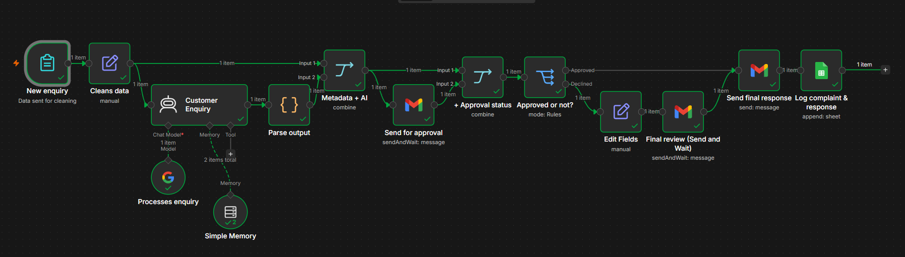

# AI Customer Support Automation with Human-in-the-Loop

An AI-powered customer support workflow built with **n8n** that analyzes customer inquiries, generates structured responses, and routes them through human verification before sending a final response.

## Workflow Overview



## Workflow

**Customer Form → Data Preparation → AI Agent → Structured Output → Merge → Human Review → Decision → Customer Email**

### How it works

1. **Customer submits an inquiry**

   * Customer information and complaint are captured through an n8n form.

2. **Data preparation**

   * Input data is cleaned and formatted before being sent to the AI.

3. **AI analysis**

   * An AI Agent analyzes the complaint and generates a proposed response.

4. **Structured output**

   * The AI response is parsed into a predictable structure for downstream processing.

5. **Metadata integration**

   * The AI response is combined with the relevant customer metadata.

6. **Human-in-the-loop verification**

   * A human reviewer receives the proposed response and can approve it or edit it.

7. **Final response**

   * The approved or edited response is sent to the customer by email.

## Key Features

* AI-assisted customer support
* Structured AI output
* Data transformation and normalization
* Customer metadata handling
* Human-in-the-loop verification
* Conditional approval/rejection logic
* Human editing and override
* Automated customer email delivery
* Unique request/session identification

## Technologies

* **n8n**
* **AI Agent / LLM**
* **Gmail**
* **Google Forms / n8n Forms**
* **Structured output parsing**
* **Conditional workflow logic**

## Architecture

```text
Customer
   ↓
n8n Form
   ↓
Data Preparation
   ↓
AI Agent
   ↓
Structured Output
   ↓
Merge with Customer Metadata
   ↓
Human Review
   ↓
Approve / Edit
   ↓
Final Response
   ↓
Customer Email
```

## Production Considerations

This project is a prototype demonstrating the automation architecture.

For production customer support, the workflow could be extended with:

* RAG using approved company documentation
* Knowledge-base retrieval
* Authentication and authorization
* Error handling and retries
* Logging and audit trails
* Monitoring
* Rate limiting
* Additional validation

The RAG layer would allow responses to be grounded in company-specific policies, procedures, product information, and other approved internal documentation.

## Note

Credentials and real customer data have been removed from this portfolio version. Credentials must be configured separately when importing the workflow.
